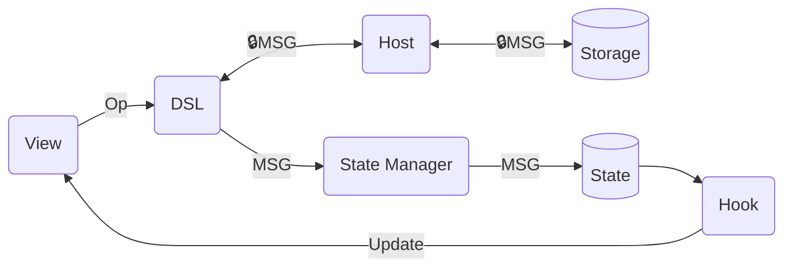

# System Architecture

```mermaid
flowchart LR
  A1(View) -->|Op| B1(DSL)
  B1 <-->|🔒MSG| H(Host)
  H <-->|🔒MSG| S[(Storage)]
  B1 --> |MSG| C1(State Manager)
  C1 --> |MSG| D1[(State)]
  D1 --> E1(Hook)
  E1 -->|Update| A1
```

1. In the DIPLOMATIC protocol, when a user performs a state-altering action in a client application, the app generates a change descriptor called an **operation**, or **op** for short.
2. The app sends that op into the DIPLOMATIC client (labeled **DSL** for DIPLOMATIC Sync Layer), which encodes it as a message (msg) for storage and relay, enqueues that msg for relay to connected hosts, then applies it to update the client's state and trigger client UI updates.
3. The client then triggers a sync with connected hosts. See [Sync](./sync) for full details. The client encrypts each message with [XSalsa20-Poly1305](https://doc.libsodium.org/secret-key_cryptography/secretbox#algorithm-details), using a distinct key per-host, to prevent cross-host identification of clients or their data. The client deterministically derives each of these encryption keys from its private **seed**, the only secret a user needs to secure.
4. The client derives this per-host key using a user-assigned unique label for each host. To identify to the host, for authentication, the client deterministically derives an [Ed25519 keypair](https://doc.libsodium.org/public-key_cryptography/public-key_signatures#algorithm-details) from its seed combined with the host label. To create an account with a host, the client registers this derived public key with the host (payment may be required at this step).
5. Upon receipt of an encrypted op—with a valid signature corresponding to a registered user’s keypair—the host records the encrypted op to persistent storage.
6. Any number of clients can sync to the same host. As long as the user initializes each client with the same private seed, they will each derive the same keypair when connected to the same host.
7. Periodically, or upon notice of new data by the host, each client queries the host for new (encrypted) messages since last sync. If it receives any, it then decrypts them and passes them to the client handler, which processes these remote messages through the exact same path that locally-generated ones traverse.
