# System Architecture

```mermaid
flowchart LR
  A1(View) -->|Op| B1(DSL)
  B1 <-->|🔒OP| H(Host)
  H <-->|🔒OP| S[(Storage)]
  B1 --> |Op| C1(Handler)
  C1 --> |Op| D1[(State)]
  D1 --> E1(Hook)
  E1 -->|Update| A1
```

1. In the DIPLOMATIC protocol, when a user performs a state-altering action in a client application, the app generates a change descriptor called an **operation**, or **op** for short.
2. The app sends that op into the **DSL** (DIPLOMATIC Sync Layer), which then passes the op to the client’s op handler, which makes the appropriate alteration to client state (e.g. modifies a client database).
3. At the same time, the DSL encodes the op using [msgpack](https://msgpack.org), encrypts it with [XSalsa20-Poly1305](https://doc.libsodium.org/secret-key_cryptography/secretbox#algorithm-details), and pushes the encrypted op to a **host**. The client deterministically derives its encryption key from a private **seed**, the only secret a user needs to secure.
4. To authenticate with a host, a client first retrieves a host’s **ID**, from the host, then deterministically derives an [Ed25519 keypair](https://doc.libsodium.org/public-key_cryptography/public-key_signatures#algorithm-details) from its seed combined with the host ID. This allows a host to change URLs while still retaining client credentials. The client then registers its public key with the host (payment may be required at this step).
5. Upon receipt of an encrypted op—with a valid signature corresponding to a registered user’s keypair—the host records the encrypted op to persistent storage.
6. Any number of clients can sync to the same host. As long as the user initializes each client with the same private seed, they will each derive the same keypair when connected to the same host.
7. Periodically, or upon notice of new data by the host, each client DSL queries the host for new (encrypted) ops since last sync. If the DSL receives any new ops, it then decrypts them and passes them to the client handler, which processes these remote ops through the exact same path that locally-generated ops traverse.
