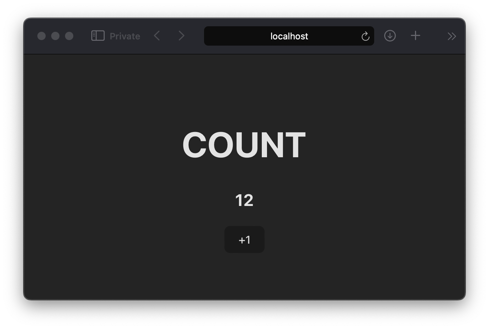

# COUNT

## Demo

Visit [https://diplomatic-count.replit.app](https://diplomatic-count.replit.app/) for a live demo. Open in multiple tabs or on multiple devices and note the count syncs in real-time.

Source code is at https://replit.com/@masonicboom/COUNT#src/App.tsx.

## Usage

1. `npm create vite@latest`
2. `cd` into that directory
3. `npm install @interncom/diplomatic`
4. Configure `vite.config.ts` to target `es2022` for [top-level await](https://tc39.es/proposal-top-level-await/) support (used in [our fork of libsodium.js](https://github.com/interncom/libsodium.js/tree/esm)).

```jsx
export default defineConfig({
  plugins: [react()],
  server: {
    host: '0.0.0.0',
  },
  build: {
    target: 'es2022',
  },
  optimizeDeps: { esbuildOptions: { target: 'es2022' } },
})
```

1. Then, change your `App.tsx` to this.

```tsx
import { StateManager, useStateWatcher, idbStore, DiplomaticClient } from '@interncom/diplomatic'

const appState = { count: 0 };
const stateMgr = new StateManager(async (op) => {
  if (op.type === "count" && typeof op.body === "number") {
    appState.count = op.body;
  }
}, async () => { appState.count = 0 })

const client = new DiplomaticClient({
  seed: "0123456789ABCDEF0123456789ABCDEF0123456789ABCDEF0123456789ABCDEF",
  hostURL: "https://diplomatic-cloudflare-host.root-a00.workers.dev",
  stateManager: stateMgr,
  store: idbStore,
});

export default function App() {
  const count = useStateWatcher(stateMgr, "count", () => appState.count)
  const inc = () => client.upsert("count", count + 1)

  return (
    <div style={{ width: "100vw", textAlign: "center" }}>
      <h1>COUNT</h1>
      <h2>{count}</h2>
      <button onClick={inc}>+1</button>
    </div>
  )
}
```

1. Do `npm run dev` and open the URL it provides. You’ll see an app like this.



1. Push the `+1` button to increment the counter.
2. Open a second browser window pointed to the same URL.
3. Try pushing the `+1` button in that second browser.
4. Notice that both browsers update to the same count.
5. Clone the repo at https://github.com/interncom/DIPLOMATIC.
6. `DIPLOMATIC_HOST_URL=https://diplomatic-cloudflare-host.root-a00.workers.dev DIPLOMATIC_SEED_HEX=0123456789ABCDEF0123456789ABCDEF0123456789ABCDEF0123456789ABCDEF deno run --allow-net --allow-env demos/count/cli/count.ts 7777`
7. Observe that both browsers update to 7777.

## Code Walkthrough

Here is a line-by-line breakdown of that code.

```tsx
import { DiplomaticClient, StateManager, useStateWatcher, localStorageStore } from '@interncom/diplomatic'
import { DiplomaticClient, StateManager, useStateWatcher, idbStorageStore } from '@interncom/diplomatic'
```

Import the application components of the DIPLOMATIC protocol: the DSL, the op handler, and a hook to notify view code when an op has been handled (suggesting there’s fresh data to render). Also, a pluggable storage module the DSL uses to store its internal state.

```tsx
const appState = { count: 0 };
```

Set up the client database, `appState`, which is simply a JavaScript object.

```tsx
const stateMgr = new StateManager(async (op) => {
  if (op.type === "count" && typeof op.body === "number") {
    appState.count = op.body;
  }
}, async () => { appState.count = 0 })
```

Create the op handler, which updates the `appState` database in response to ops of type `count`, and knows how to clear the database when appropriate. A more-complex application may handle multiple types of operation, and use a more advanced database such as IndexedDB.

```tsx
const client = new DiplomaticClient({
  seed: "0123456789ABCDEF0123456789ABCDEF0123456789ABCDEF0123456789ABCDEF",
  hostURL: "https://diplomatic-cloudflare-host.root-a00.workers.dev",
  stateManager: stateMgr,
  store: idbStorageStore,
});
```

Initialize the DSL, with a private seed (hex-encoded), the URL of a host to sync with, and the operation handler (defined previously). This host URL points to a live demo host. See the next section for how to run your own. The `store` is what the DSL uses to store its internal state. The DSL will register with the host and connect via WebSockets to get real-time updates when a

```tsx
export default function App() {
```

Set up a [React function component](https://react.dev/learn/your-first-component).

```tsx
const count = useStateWatcher(stateMgr, "count", () => appState.count)
```

Load the current count from the application database into a React state variable, and update it as the operation handler makes changes. The first parameter is the operation handler. The second is a filter to only listen to operations of a given type. The final parameter is a function that retrieves the desired data from the application database.

```tsx
const inc = () => client.upsert("count", count + 1)
```

Prepare a function that generates operations which increment the count.

```tsx
return (
  <div style={{ width: "100vw", textAlign: "center" }}>
    <h1>COUNT</h1>
    <h2>{count}</h2>
    <button onClick={inc}>+1</button>
  </div>
)
```

Create the view: a container with a title, the current count, and a button that triggers the increment function when pressed.

That’s it.
