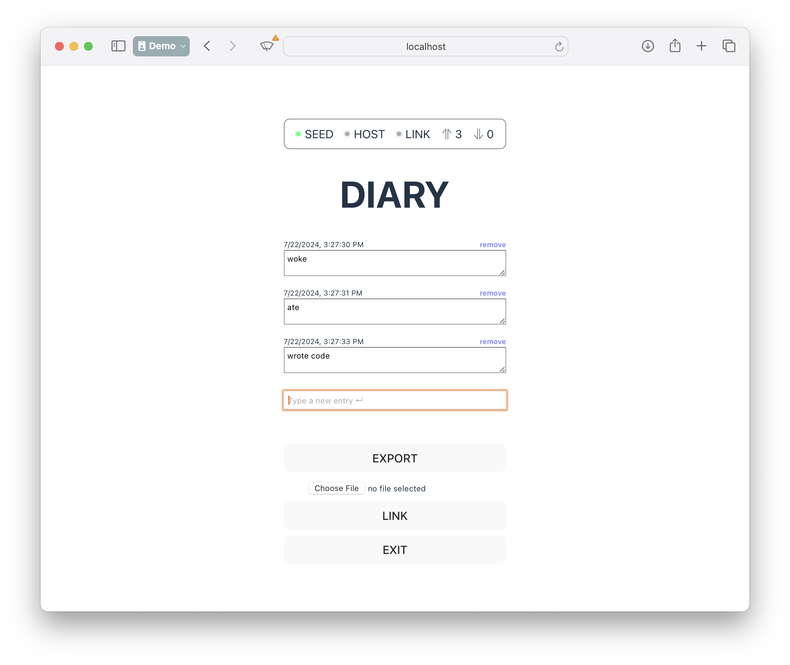

# DIARY



## Demo

Visit [https://diplomatic-diary.replit.app](https://diplomatic-diary.replit.app/) for a live demo.

Source code is at https://replit.com/@masonicboom/DIARY#src/App.tsx.

## Usage

1. Generate a seed.
2. Enter an account name.
3. Press `INIT` and save the credentials when prompted (this is important).
4. Write some diary entries in the text box (hit Enter to record an entry).
5. Press `EXPORT` to save you data to a file.
6. Press `EXIT` to un-authenticate ("log out").
7. Use your stored credentials to log back in again.
8. Use the file chooser below the `EXPORT` button and select that file you just exported.
9. Notice that your diary entries re-appear (and you never linked to a host).

## Code Walkthrough

The code is very similar to prior demos, so refer to those (e.g. [TODO](./todo)) for a line-by-line walkthrough.

```tsx
<button type="button" onClick={() => client.export('diary')}>EXPORT</button>
<FilePicker onPick={client.import} />
```

These two lines are where the import and export functionality happens.

```tsx
<button type="button" onClick={() => client.export('diary')}>EXPORT</button>
```

This line calls `client.export()` with the filename (excluding the extension) to use for the exported file.

```tsx
<FilePicker onPick={client.import} />
```

This line creates a `<FilePicker>` component which calls `client.import` with the selected `File`.

Here is the implementation of `<FilePicker>`:

```tsx
interface IProps {
  onPick: (buf: File) => void;
}
export default function FilePicker({ onPick }: IProps) {
  const handleFileSelect = async (event: React.ChangeEvent<HTMLInputElement>) => {
    const input = event.target;
    if (input.files && input.files.length > 0) {
      const file = input.files[0];
      onPick(file);
    }
  };
  return <input type="file" onChange={handleFileSelect} />
}
```

All of the real work happens in the two client methods [`import` and `export`](../api/client#import-export).

## Summary

This DIARY demo shows how to import and export operations via `.dip` files, allowing data to be synchronized between clients without a host.
