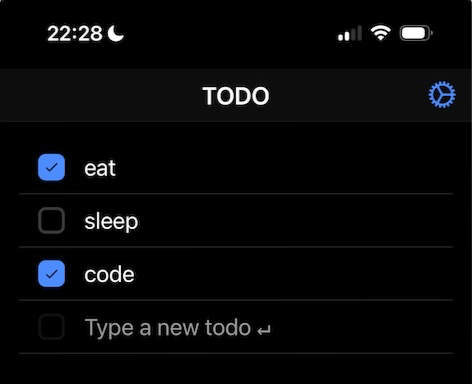

# IONIC

## Demo

This demonstrates an app built with DIPLOMATIC for sync and [Ionic](https://ionicframework.com/) for native-like mobile UI. Visit [https://diplomatic-ionic.replit.app](https://diplomatic-ionic.replit.app/) for a live demo. Open in multiple tabs or on multiple devices and note the todos sync in real-time.

Source code is at https://replit.com/@masonicboom/IONIC#src/App.tsx.

## Usage

1. Generate a seed.
2. Enter an account name.
3. Press `Login` and save the credentials when prompted (this is important).
4. Write some todos.
5. Login with another device (e.g. phone and computer).
6. Add, edit, or check todos on one device. Notice they instantly sync to the other.

## Features

- Native-like UI
- E2EE real-time sync
- File import/export
