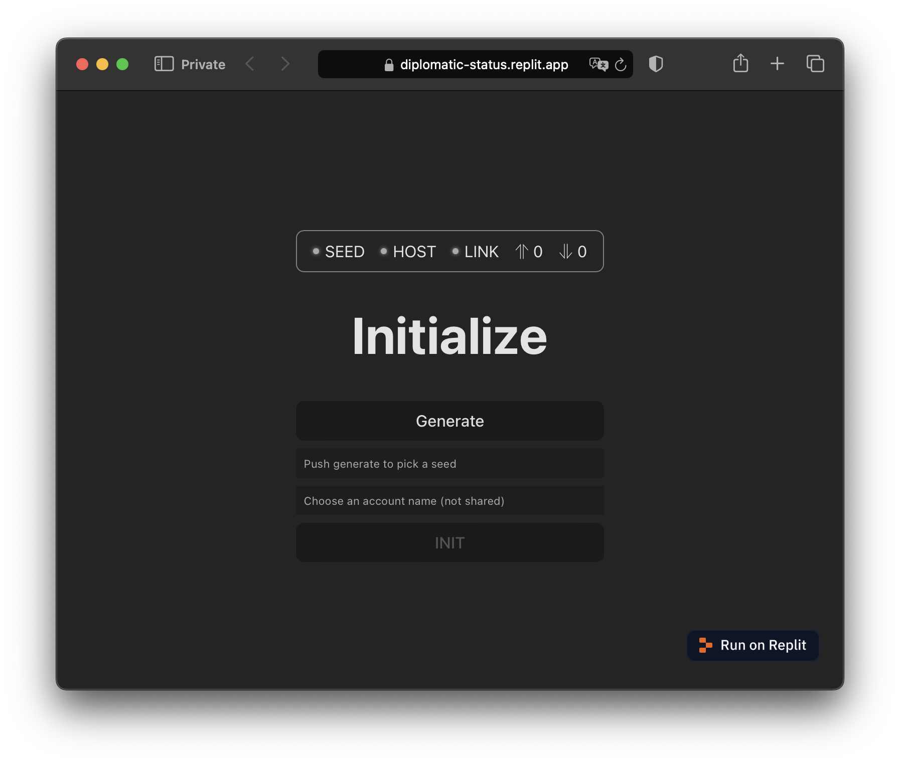
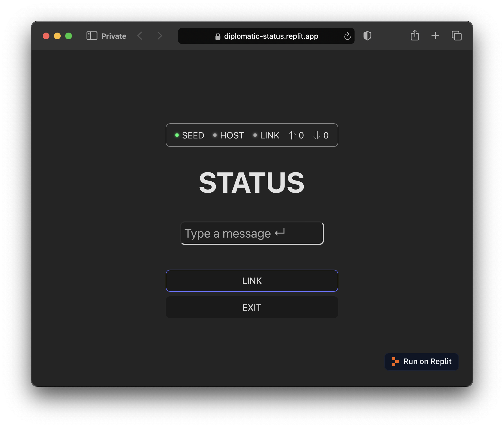
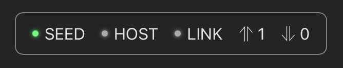

# STATUS

<video src="https://pub-baf63544dce04e12a9502ae4f58bdc2b.r2.dev/diplomatic-status-demo-720.mov" controls />

## Demo

Visit [https://diplomatic-status.replit.app](https://diplomatic-status.replit.app/) for a live demo. Open in multiple tabs or on multiple devices and note the status messages sync in real-time.

Source code is at https://replit.com/@masonicboom/STATUS#src/App.tsx.

## Usage

1. `npm create vite@latest`
2. `cd` into that directory
3. `npm install @interncom/diplomatic`
4. Configure `vite.config.ts` to target `es2022` for [top-level await](https://tc39.es/proposal-top-level-await/) support (used in [our fork of libsodium.js](https://github.com/interncom/libsodium.js/tree/esm)).

```jsx
export default defineConfig({
  plugins: [react()],
  server: {
    host: '0.0.0.0',
  },
  build: {
    target: 'es2022',
  },
  optimizeDeps: { esbuildOptions: { target: 'es2022' } },
})
```

1. Then, change your `App.tsx` to this.

```tsx
import './App.css'
import { useCallback, useState } from 'react';
import { DiplomaticClient, idbStore, type IOp, opMapApplier, StateManager } from '@interncom/diplomatic'
import { ClientStatusBar, InitSeedView, useStateWatcher, useClientState, useSyncOnResume } from '@interncom/diplomatic';

interface IStatus {
  status: string;
  updatedAt: string;
}

const statusStore = {
  store(status: IStatus) {
    localStorage.setItem("status", status.status);
    localStorage.setItem("updatedAt", status.updatedAt);
  },
  load(): IStatus | undefined {
    const status = localStorage.getItem("status") ?? undefined;
    const updatedAt = localStorage.getItem("updatedAt") ?? undefined;
    if (!status || !updatedAt) {
      return undefined;
    }
    return { status, updatedAt };
  },
  async clear() {
    localStorage.removeItem("status");
  }
}

export interface IStatusOp extends IOp {
  type: "status";
  body: string;
}

const applier = opMapApplier<{ status: IStatusOp }>({
  "status": {
    check: (op: IOp): op is IStatusOp => {
      return op.type === "status" && typeof op.body === "string";
    },
    apply: async (op: IStatusOp) => {
      const curr = statusStore.load();
      if (!curr?.updatedAt || op.ts > curr.updatedAt) {
        const status = op.body;
        statusStore.store({ status, updatedAt: op.ts });
      }
    }
  }
});
const stateManager = new StateManager(applier, statusStore.clear)
const client = new DiplomaticClient({ store: idbStore, stateManager });

const hostURL = "https://diplomatic-cloudflare-host.root-a00.workers.dev";

export default function App() {
  useSyncOnResume(client);
  const state = useClientState(client);
  const link = useCallback(() => { client.registerAndConnect(hostURL) }, []);

  const status = useStateWatcher(stateManager, "status", statusStore.load);
  const [statusField, setStatusField] = useState("");
  const handleSubmit = useCallback((evt: React.FormEvent) => {
    evt.preventDefault();
    client.upsert("status", statusField);
    setStatusField("");
  }, [statusField]);

  if (!client || !state) {
    return null;
  }

  return (
    <>
      <ClientStatusBar state={state} />
      {state.hasSeed ? (
        <>
          <h1>STATUS</h1>
          <div id="status-message">{status?.status}</div>
          <div id="status-timestamp">{status?.updatedAt}</div>
          <form onSubmit={handleSubmit}>
            <input id="status-input" type="text" value={statusField} onChange={(evt) => setStatusField(evt.target.value)} placeholder="Type a message ↵" />
          </form>
          {
            state.hasHost
              ? <button type="button" onClick={client.disconnect}>UNLINK</button>
              : <button type="button" onClick={link}>LINK</button>
          }
          <button type="button" onClick={client.wipe}>EXIT</button>
        </>
      ) : (
        <InitSeedView client={client} path="/" />
      )}
    </>
  );
}
```

1. Do `npm run dev` and open the URL it provides. You’ll see an app like this.

    

2. Push the Generate button, choose a username, hit enter or INIT, and save the password when prompted.
3. Now you’ll see a screen like this. The green light next to `SEED` indicates the client now has a cryptographic seed in place (used to encrypt operations and authenticate with hosts, via derived keys).

    

4. Type a status message and hit enter. Notice the up arrow in the status bar has a `1` next to it. That indicates 1 operation is queued for upload. Type a few more if you like.
5. Push the `LINK` button to connect to the demo host, running at `https://diplomatic-cloudflare-host.root-a00.workers.dev`.
6. First the `HOST` light will activate, indicating a host is configured in the client. Then the `LINK` light will activate, indicating a WebSocket connection with the host is live.
7. Notice that the upload queue count drops to zero upon connecting.
8. Open STATUS in a new browser window, use your password manager to fill the same seed (if necessary), then link and observe that the second browser window gets into sync with the first.

## Code Walkthrough

Here is a line-by-line breakdown of that code.

### Imports

```tsx
import './App.css'
import { useCallback, useState } from 'react';
import { DiplomaticClient, idbStore, type IOp, opMapApplier, StateManager } from '@interncom/diplomatic'
import { ClientStatusBar, InitSeedView, useStateWatcher, useClientState, useSyncOnResume } from '@interncom/diplomatic';
```

Import CSS for style, React utilities, and various pieces of the DIPLOMATIC client library.

### Database

```tsx
interface IStatus {
  status: string;
  updatedAt: string;
}

const statusStore = {
  store(status: IStatus) {
    localStorage.setItem("status", status.status);
    localStorage.setItem("updatedAt", status.updatedAt);
  },
  load(): IStatus | undefined {
    const status = localStorage.getItem("status") ?? undefined;
    const updatedAt = localStorage.getItem("updatedAt") ?? undefined;
    if (!status || !updatedAt) {
      return undefined;
    }
    return { status, updatedAt };
  },
  async clear() {
    localStorage.removeItem("status");
  }
}
```

Create a structure to organize setting, retrieving, and clearing the status message, backed by the browser’s localStorage for persistence between refreshes.

### State Manager

```tsx
export interface IStatusOp extends IOp {
  type: "status";
  body: string;
}

const applier = opMapApplier<{ status: IStatusOp }>({
  "status": {
    check: (op: IOp): op is IStatusOp => {
      return op.type === "status" && typeof op.body === "string";
    },
    apply: async (op: IStatusOp) => {
      const curr = statusStore.load();
      if (!curr?.updatedAt || op.ts > curr.updatedAt) {
        const status = op.body;
        statusStore.store({ status, updatedAt: op.ts });
      }
    }
  }
});
const stateManager = new StateManager(applier, statusStore.clear)
```

Create the op handler, which updates the `statusStore` database in response to ops of type `status`, and knows how to clear the database when appropriate. This app uses `opMapApplier`, a convenience method that DIPLOMATIC provides to organize multiple types of appliers. For each type of op, you specify a `check` function which indicates whether an op is of the expected type, and an `apply` function which applies an op of that type.

### Client (DSL)

```tsx
const client = new DiplomaticClient({ store: idbStore, stateManager });
```

Initialize the DSL, with the just-defined `stateManager` and an `idbStore` as the client’s backing store. `idbStore` uses IndexedDB to organize the DSL’s state, such as operations pending upload or download.

```jsx
const hostURL = "https://diplomatic-cloudflare-host.root-a00.workers.dev";
```

Hardcode the demo server URL.

### App Component

```tsx
export default function App() {
```

Set up a React function component.

```jsx
useSyncOnResume(client);
```

Sync the client after network connectivity resumes.

### DSL State Observation

```jsx
const state = useClientState(client);
```

Watch for changes to the client’s state, which looks like this:

```jsx
export interface IDiplomaticClientState {
  hasSeed: boolean;
  hasHost: boolean;
  connected: boolean;
  numUploads: number;
  numDownloads: number;
}
```

This is what the client’s state looks like. Well, at least the state it exposes via `useClientState`.

### Host Management

```jsx
const link = useCallback(() => { client.registerAndConnect(hostURL) }, []);
```

A function to link the DSL to the host.

### App State Observation and Mutation

```jsx
const status = useStateWatcher(stateManager, "status", statusStore.load);
```

Observe changes to the status message, by loading them from `statusStore` on each op application.

```jsx
const [statusField, setStatusField] = useState("");
const handleSubmit = useCallback((evt: React.FormEvent) => {
  evt.preventDefault();
  client.upsert("status", statusField);
  setStatusField("");
}, [statusField]);
```

Manage contents of and changes to the status text field. On each (submitted) change, apply an `UPSERT` to change the status message.

### Loading

```jsx
if (!client || !state) {
  return null;
}
```

Wait for the client state to load before presenting UI.

### Status Bar

```jsx
return (
    <>
      <ClientStatusBar state={state} />
```

Show a status bar based on the DSL’s state.



This is what the status bar looks like. For convenience, the DIPLOMATIC client library provides this component.

### UI Hierarchy

```jsx
{state.hasSeed ? (
  <>
    <h1>STATUS</h1>
    <div id="status-message">{status?.status}</div>
    <div id="status-timestamp">{status?.updatedAt}</div>
    <form onSubmit={handleSubmit}>
      <input id="status-input" type="text" value={statusField} onChange={(evt) => setStatusField(evt.target.value)} placeholder="Type a message ↵" />
    </form>
    {
      state.hasHost
        ? <button type="button" onClick={client.disconnect}>UNLINK</button>
        : <button type="button" onClick={link}>LINK</button>
    }
    <button type="button" onClick={client.wipe}>EXIT</button>
  </>
```

If the DSL has a seed loaded, present the main UI, including the status message and its timestamp, a text field to update the message, and controls to link/unlink from the host as well as clear the DSL’s seed (ensure you’ve saved it first!)

```tsx
return (
  <div style={{ width: "100vw", textAlign: "center" }}>
    <h1>COUNT</h1>
    <h2>{count}</h2>
    <button onClick={inc}>+1</button>
  </div>
)
```

Create the view: a container with a title, the current count, and a button that triggers the increment function when pressed.

```tsx
<InitSeedView client={client} path="/" />
```

If the DSL doesn’t have a seed, present a view to generate and store a seed. For convenience, DIPLOMATIC provides this view in the client library.

### <InitSeedView />

```jsx
import { useState, useCallback, type FormEvent } from "react";
import type DiplomaticClient from "../client";
import libsodiumCrypto from "../crypto";
import { btoh, htob } from "../shared/lib";

interface IProps {
  client: DiplomaticClient;
  path: string; // Where to navigate after setting seed.
}
export default function InitSeedView({ client, path }: IProps) {
  const [seedString, setSeedString] = useState("");
  const [username, setUsername] = useState("");

  const genSeed = useCallback(async () => {
    const seed = await libsodiumCrypto.gen256BitSecureRandomSeed();
    const seedStr = btoh(seed);
    setSeedString(seedStr);
  }, []);

  const handleInitFormSubmit = useCallback(async (e: FormEvent) => {
    e.preventDefault();

    const seed = htob(seedString);
    await client.setSeed(seed);

    // Trigger password save prompt.
    window.location.replace(path);
  }, [seedString, client, path]);

  return (
    <div>
      <h1>Initialize</h1>
      <form id="seed" action="/" method="get" onSubmit={handleInitFormSubmit} style={{ display: "flex", flexDirection: "column" }}>
        <button type="button" onClick={genSeed}>Generate</button>
        <input name="password" type="password" autoComplete="new-password" placeholder="Push generate to pick a seed" value={seedString} onChange={(e) => setSeedString(e.target.value)} />
        <input name="username" type="text" autoComplete="username" placeholder="Choose an account name (not shared)" onChange={(e) => setUsername(e.target.value)} required />
        <button type="submit" disabled={!seedString || !username}>INIT</button>
      </form>
    </div>
  )
}
```

## Summary

In less than 100 LOC, you have an app that:

- functions offline
- buffers offline changes for sync when online
- authenticates with a cloud host
- synchronizes encrypted state changes via that host
- stores its cryptographic seed in the browser’s password manager
- achieves consistent state between multiple clients
- receives real-time state updates from its host, when online
