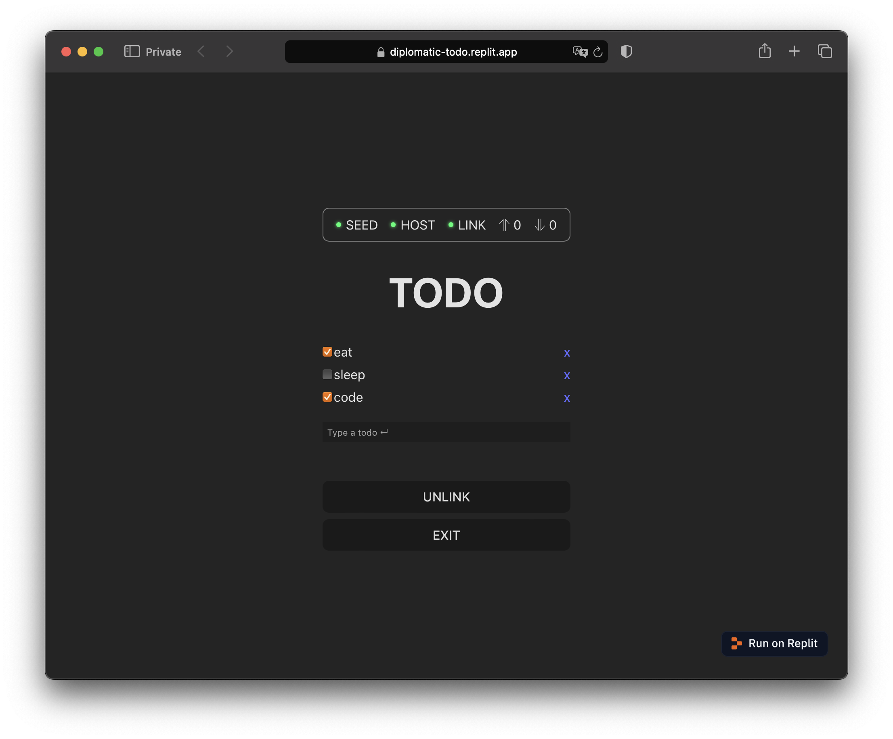
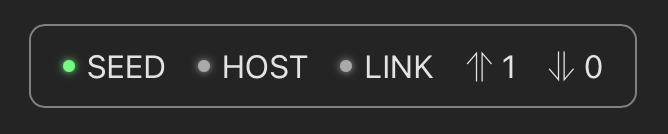

# TODO

## Demo

Visit [https://diplomatic-todo.replit.app](https://diplomatic-todo.replit.app/) for a live demo. Open in multiple tabs or on multiple devices and note the todos sync in real-time.

Source code is at https://replit.com/@masonicboom/TODO#src/App.tsx.

## Usage

1. `npm create vite@latest`
2. `cd` into that directory
3. `npm install @interncom/diplomatic`
4. Configure `vite.config.ts` to target `es2022` for [top-level await](https://tc39.es/proposal-top-level-await/) support (used in [our fork of libsodium.js](https://github.com/interncom/libsodium.js/tree/esm)).

```jsx
export default defineConfig({
  plugins: [react()],
  server: {
    host: '0.0.0.0',
  },
  build: {
    target: 'es2022',
  },
  optimizeDeps: { esbuildOptions: { target: 'es2022' } },
})
```

1. Then, change your `App.tsx` to this.

```tsx
import './App.css'
import consts from './consts.json';
import { useCallback, useState } from 'react';
import { DiplomaticClient, htob, idbStore, EntityDB, btoh } from '@interncom/diplomatic'
import { ClientStatusBar, InitSeedView, useStateWatcher, useClientState, useSyncOnResume } from '@interncom/diplomatic';
import Todo from './Todo';

export interface ITodo {
  text: string;
  done?: boolean;
}
const opType = 'todo';

const stateManager = EntityDB.stateManager;
const client = new DiplomaticClient({ store: idbStore, stateManager });

const hostURL = consts.hostURL;

async function getTodos() {
  return EntityDB.db.getAllFromIndex(EntityDB.entityTableName, EntityDB.typeIndexName, IDBKeyRange.only(opType));
}

export default function App() {
  useSyncOnResume(client);
  const state = useClientState(client);
  const link = useCallback(() => { client.registerAndConnect(hostURL) }, []);

  const todos = useStateWatcher(stateManager, opType, getTodos);
  const [valueField, setValueField] = useState("");
  const handleSubmit = useCallback(async (evt: React.FormEvent) => {
    evt.preventDefault();
    const todo: ITodo = { text: valueField };
    client.upsert<ITodo>(opType, todo);
    setValueField("");
  }, [valueField]);

  const handleChange = useCallback(async (eid: string, text: string, done: boolean) => {
    const todo: ITodo = { text, done };
    client.upsert<ITodo>(opType, todo, htob(eid));
  }, []);

  const handleDelete = useCallback(async (eid: string) => {
    client.delete(opType, htob(eid));
  }, []);

  if (!client || !state) {
    return null;
  }

  return (
    <>
      <ClientStatusBar state={state} />
      {state.hasSeed ? (
        <>
          <h1>TODO</h1>
          {todos?.map((ent) => {
            const todo = ent.body as ITodo;
            const hex = btoh(ent.eid);
            return <Todo key={hex} eid={hex} todo={todo} onChange={handleChange} onDelete={handleDelete} />;
          })}
          <form onSubmit={handleSubmit} style={{ marginBottom: 48, marginTop: 18 }}>
            <input id="value-input" type="text" value={valueField} onChange={(evt) => setValueField(evt.target.value)} placeholder="Type a todo ↵" style={{ width: "100%", boxSizing: 'border-box', padding: 4 }} />
          </form>
          {
            state.hasHost
              ? <button type="button" onClick={client.disconnect}>UNLINK</button>
              : <button type="button" onClick={link}>LINK</button>
          }
          <button type="button" onClick={client.wipe}>EXIT</button>
        </>
      ) : (
        <InitSeedView client={client} path="/" />
      )}
    </>
  );
}
```

1. Do `npm run dev` and open the URL it provides.
2. Push the Generate button, choose a username, hit enter or INIT, and save the password when prompted.
3. Now you’ll see a screen like this. The green light next to `SEED` indicates the client now has a cryptographic seed in place (used to encrypt operations and authenticate with hosts, via derived keys).

    

4. Type a todo and hit enter. Notice the up arrow in the status bar has a `1` next to it. That indicates 1 operation is queued for upload. Type a few more if you like. Check and uncheck todos. Delete some.
5. Push the `LINK` button to connect to the demo host, running at `https://diplomatic-cloudflare-host.root-a00.workers.dev`.
6. First the `HOST` light will activate, indicating a host is configured in the client. Then the `LINK` light will activate, indicating a WebSocket connection with the host is live.
7. Notice that the upload queue count drops to zero upon connecting.
8. Open TODO in a new browser window, use your password manager to fill the same seed (if necessary), then link and observe that the second browser window gets into sync with the first.

## Code Walkthrough

Here is a line-by-line breakdown of that code.

### Imports

```tsx
import './App.css'
import consts from './consts.json';
import { useCallback, useState } from 'react';
import { DiplomaticClient, htob, idbStore, EntityDB, btoh } from '@interncom/diplomatic'
import { ClientStatusBar, InitSeedView, useStateWatcher, useClientState, useSyncOnResume } from '@interncom/diplomatic';
import Todo from './Todo';
```

Import CSS for style, React utilities, and various pieces of the DIPLOMATIC client library.

### Operation Type

```tsx
export interface ITodo {
  text: string;
  done?: boolean;
}
const opType = 'todo';
```

Define the data type for the app, and its corresponding operation name.

### Database and State Manager

```tsx
const stateManager = EntityDB.stateManager;
const client = new DiplomaticClient({ store: idbStore, stateManager });
```

This TODO app uses two helpers. `idbStore` manages the internal state of the client in an IndexedDB table. `EntityDB.stateManager` also uses IndexedDB, this time to manage the application state. When an operation comes in, `EntityDB` records its `body` into an IndexedDB table named `entities`, indexed by the operation's type, and keyed on the operation's `eid` (entity ID).

```tsx
async function getTodos() {
  return EntityDB.db.getAllFromIndex(EntityDB.entityTableName, EntityDB.typeIndexName, IDBKeyRange.only(opType));
}
```

This sets up a function to list all todos. You query `EntityDB` records using the [`idbjs`](https://github.com/jakearchibald/idb) library.

For simple apps, this may be all you need for an application database.

For reference, the `EntityDB` source code looks like this.

```tsx
import { openDB, type DBSchema } from 'idb';
import { Applier } from './types';
import { IOp, Verb } from './shared/types';
import { StateManager } from './state';

export const entityTableName = 'entities';
export const typeIndexName = 'entity_type';

interface IEntityDB extends DBSchema {
  entities: {
    key: Uint8Array; // TODO: try Uint8Array;
    value: {
      eid: Uint8Array;
      type: string;
      updatedAt: Date;
      body: unknown;
    };
    indexes: {
      "entity_type": "string",
    };
  }
}

export const db = await openDB<IEntityDB>('db', 4, {
  upgrade(db) {
    const store = db.createObjectStore('entities', { keyPath: 'eid', autoIncrement: false });
    store.createIndex('entity_type', 'type');
  }
});

export const applier: Applier = async (op: IOp) => {
  switch (op.verb) {
    case Verb.UPSERT: {
      const curr = await db.get('entities', op.eid);
      if (new Date(op.ts) > (curr?.updatedAt ?? "")) {
        await db.put('entities', { eid: op.eid, type: op.type, updatedAt: new Date(op.ts), body: op.body });
      }
      break;
    }
    case Verb.DELETE: {
      await db.delete('entities', op.eid);
      break;
    }
  }
};

export const stateManager = new StateManager(applier, () => db.clear('entities'));
```

### App Component

```tsx
export default function App() {
```

Set up a React function component.

```jsx
useSyncOnResume(client);
```

Sync the client after network connectivity resumes.

### DSL State Observation

```jsx
const state = useClientState(client);
```

Watch for changes to the client’s state, which looks like this:

```jsx
export interface IDiplomaticClientState {
  hasSeed: boolean;
  hasHost: boolean;
  connected: boolean;
  numUploads: number;
  numDownloads: number;
}
```

This is what the client’s state looks like. Well, at least the state it exposes via `useClientState`.

### Host Management

```jsx
const link = useCallback(() => { client.registerAndConnect(hostURL) }, []);
```

A function to link the DSL to the host.

### App State Observation and Mutation

```jsx
const todos = useStateWatcher(stateManager, opType, getTodos);
```

Observe changes to todos using the previously-defined `getTodos` function that queries `EntityDB`.

```jsx
const [valueField, setValueField] = useState("");
const handleSubmit = useCallback(async (evt: React.FormEvent) => {
  evt.preventDefault();
  const todo: ITodo = { text: valueField };
  client.upsert<ITodo>(opType, todo);
  setValueField("");
}, [valueField]);
```

Manage the new todo text field. On each (submitted) change, apply an `UPSERT` to add a new todo.

```tsx
const handleChange = useCallback(async (eid: string, text: string, done: boolean) => {
  const todo: ITodo = { text, done };
  client.upsert<ITodo>(opType, todo, htob(eid));
}, []);

const handleDelete = useCallback(async (eid: string) => {
  client.delete(opType, htob(eid));
}, []);
```

Handle checking and deleting todos.

### Loading

```jsx
if (!client || !state) {
  return null;
}
```

Wait for the client state to load before presenting UI.

### Status Bar

```jsx
return (
    <>
      <ClientStatusBar state={state} />
```

Show a status bar based on the DSL’s state.



This is what the status bar looks like. For convenience, the DIPLOMATIC client library provides this component.

### UI Hierarchy

```jsx
{state.hasSeed ? (
  <>
    <h1>TODO</h1>
    {todos?.map((ent) => {
      const todo = ent.body as ITodo;
      const hex = btoh(ent.eid);
      return <Todo key={hex} eid={hex} todo={todo} onChange={handleChange} onDelete={handleDelete} />;
    })}
    <form onSubmit={handleSubmit} style={{ marginBottom: 48, marginTop: 18 }}>
      <input id="value-input" type="text" value={valueField} onChange={(evt) => setValueField(evt.target.value)} placeholder="Type a todo ↵" style={{ width: "100%", boxSizing: 'border-box', padding: 4 }} />
    </form>
    {
      state.hasHost
        ? <button type="button" onClick={client.disconnect}>UNLINK</button>
        : <button type="button" onClick={link}>LINK</button>
    }
    <button type="button" onClick={client.wipe}>EXIT</button>
  </>
```

If the DSL has a seed loaded, present the main UI, including a list of all todos and a control to add new ones, and controls to link/unlink from the host as well as clear the DSL’s seed (ensure you’ve saved it first!)

```tsx
<InitSeedView client={client} path="/" />
```

If the DSL doesn’t have a seed, present a view to generate and store a seed. For convenience, DIPLOMATIC provides this view in the client library.

### Todo Component

```tsx
import { ITodo } from "./App";

interface IProps {
  eid: string;
  todo: ITodo;
  onChange: (eid: string, text: string, checked: boolean) => void;
  onDelete: (eid: string) => void;
}
export default function Todo({ eid, todo, onChange, onDelete }: IProps) {
  return (
    <div key={eid} style={{ display: 'flex', alignItems: 'center', margin: '4px 0' }}>
      <input
        type="checkbox"
        checked={todo.done ?? false}
        onChange={e => onChange(eid, todo.text, e.target.checked)}
        style={{ marginLeft: 0 }}
      />
      <div style={{ flex: 1, textAlign: 'left' }}>{todo.text}</div>
      <a style={{ cursor: 'pointer' }} onClick={() => onDelete(eid)}>x</a>
    </div>
  );
}
```

Render an individual todo with controls to check and delete it.

## Summary

This TODO demo shows how to use the built-in `EntityDB` as your application database.
